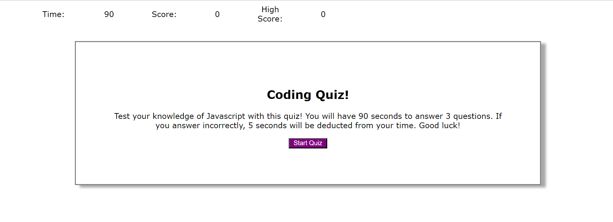
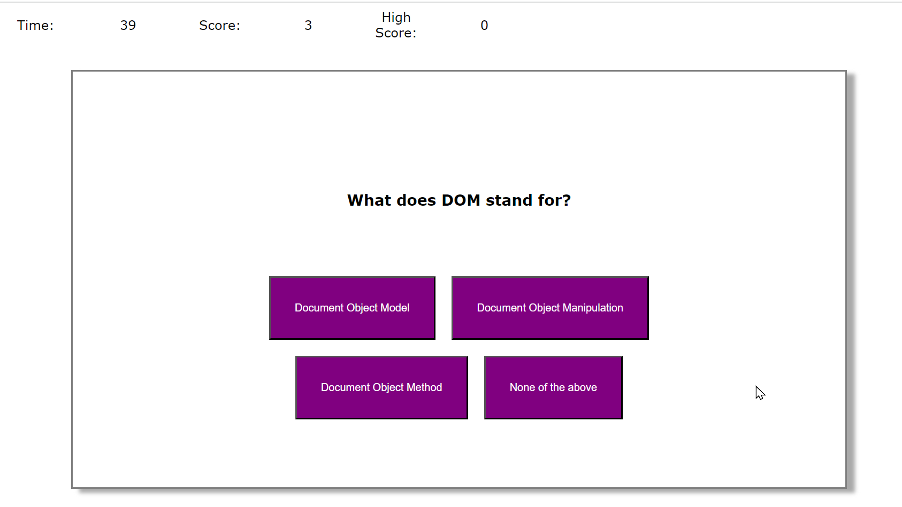

# dynamic-timed-quiz-
Challenge 4

### User Story

* AS A coding boot camp student
* I WANT to take a timed quiz on JavaScript fundamentals that stores high scores
* SO THAT I can gauge my progress compared to my peers

### Acceptance Criteria 

* GIVEN I am taking a code quiz
* WHEN I click the start button
* THEN a timer starts and I am presented with a question
* WHEN I answer a question
* THEN I am presented with another question
* WHEN I answer a question incorrectly
* THEN time is subtracted from the clock
* WHEN all questions are answered or the timer reaches 0
* THEN the game is over
* WHEN the game is over
* THEN I can save my initials and score

### Development

* Main screen, question, and answer text generates dynamically using DOM
* A message is displayed if the user selects the correct or incorrect answer, time is subtracted from timer if incorrect answer is selected
* Questions and answers are held in object arrays, encountered some issues referencing the correct index when rendering the Q&A to the browser
* If time runs out a message is displayed along with a 'try again' button
* At the end of the quiz the user can input their initials to save their score and a list of scores is saved to local storage
* Received assistance from BCA and classmates

### Screenshot

### Deployment
Link - https://ji-yoh.github.io/dynamic-timed-quiz-/